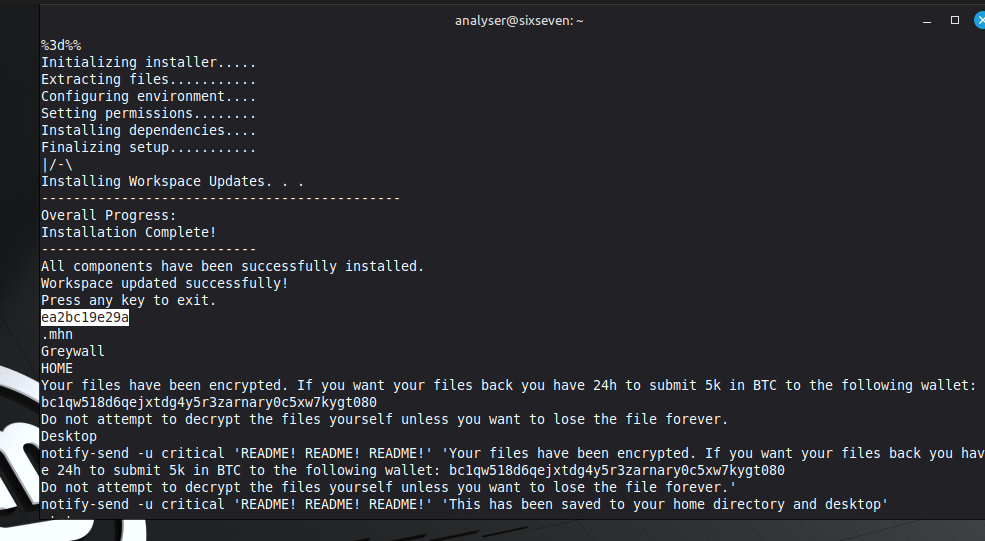
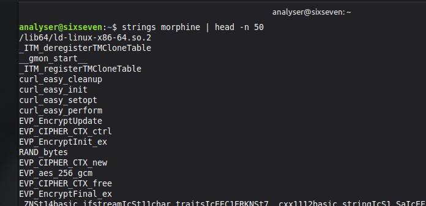

# Morphine Analysis

### Project Location
[Morphine repo](https://github.com/UnDefinedCS/morphine)

### VM Environment
OS - Mint Linux Cinnamon

Configure:
```bash
# allow snapd installation
sudo rm -f /etc/apt/preferences.d/nosnap.pref

# install reverse engineering / debugging tools
sudo apt update && sudo apt install -y snapd gdb
sudo snap install ghidra
```

### Reviewed binary using strings
Initially the strings output was noisy so I used grep to filter it out to make better sense of the data but we do have insight on the encryption used as there are indicators of `aes_256_gcm` from a normal strings output, we can filter the noise via `strings morphine | grep -v "_Z*"`



We can see from strings that we can see the file contents about the BTC wallet are hard-coded we can see the full command it runs concerning notify-send, along with it we can see a list of potential files this program targets, as well as a string we should note down for later: `ea2bc19e29a`.

### Prepared Ghidra against the binary
Initially we look at the functions and find main and start there, looking through the lines we can see the `run` function that runs a `runBgProc` function on a separate thread, this is interesting because background is the best place to hide malicious code.

Looking into `runBgProc` we can see a Manager object is created and runs the following:
- perform()
- leaveGift()

Looking into leaveGift this is responsible for leaving the ransom note on the disk, lets look at the perform function.

This function is clearly dangerous, it is searching for files and there is something running `inject`.

Looking into `inject` we've discovered the primary area responsible for encrypting the files:
  
```
enc_aes(this,param_2);
std::filesystem::__cxx11::path::path<>(local_48,param_2,2);
                /* try { // try from 001083a8 to 001083ac has its C atchHandler @ 001083cb */
std::filesystem::remove(local_48);
std::filesystem::__cxx11::path::~path(local_48)
```

We can also see not only does it encrypt but remove the original after its finished running running the encryption. Luckily there is a function that does the full operation `enc_aes`.

Looking around we can see there is a `getData` call and exploring it there is a `downloadData` call. We can see that the `ea2bc19e29a` string from earlier came back in this function, next is resolving a snippet of interest:
```
for (local_b4 = 0; local_b4 < len; local_b4 = local_b4 + 1) {
    uVar1 = *(undefined4 *)(ept + (long)local_b4 * 4);
    local_b0 = local_b0 + 1;
    std::__cxx11::string::length();
                /* try { // try from 0010801d to 001080e3 has its C atchHandler @ 001081db */
    pbVar2 = (byte *)std::__cxx11::string::operator[]((ulong)loc al_48);
    std::__cxx11::string::operator+=(local_68,*pbVar2 ^ (byte)u Var1);
}
uVar3 = std::__cxx11::string::c_str();
curl_easy_setopt(local_a8,0x2712,uVar3);
curl_easy_setopt(local_a8,0x4e2b,WriteCallback);
curl_easy_setopt(local_a8,0x2711,local_88);
local_ac = curl_easy_perform(local_a8)
```

There is some interesting information here. In Ghidra we can rename variables so its more readable to us.
```
std::__cxx11::string::string<>(sus_str,"ea2bc19e29a",&local_ b5);
std::__new_allocator<char>::~__new_allocator((__new_alloca tor<char> *)&local_b5);
i = 0;
for (k = 0; k < len; k = k + 1) {
    element = *(undefined4 *)(ept + (long)k * 4);
    i = i + 1;
    std::__cxx11::string::length();
    sus_char = (byte *)std::__cxx11::string::operator[]((ulong)s us_str);
    std::__cxx11::string::operator+=(resultString,*sus_char ^ ( byte)element);
}
```
We can now clearly see there is a XOR cipher being performed between vaiables:
- ept
- ea2bc19e29a

Lets see what exactly `ept` is.

Ghidra shows a list of addresses holding a hexadecimal value, there is no simple way to copy the data so we will need to write it down manually, we can see a lot of `00` sequence these are null-bytes meaning they are insignificant, filler basically.
```
0d
15
46
12
10
0b
16
4a
42
58
12
11
04
50
0b
0d
1f
5a
0a
5f
16
13
04
16
1d
2f
08
77
6a
35
04
0b
26
```
I went into [cyberchef](https://gchq.github.io/CyberChef/) and performed `From Hex + To Decimal` and got the following:
```
13 21 70 18 16 11 22 74 66 88 18 17 4 80 11 13 31 90 10 95 22 19 4 22 29 47 8 119 106 53 4 11 38
```

We need to just remove the 0s and we will have a list of integers. This is important because integers can be converted to characters.

Now we have 2 options:
1. With these items we can write out own C++ program to see what the XOR cipher generated.

2. From looking at Ghidra we can see there are cURL requests being made, maybe we can use GDB to extract the registers of the function call!
```
(gdb) break main
(gdb) break inject
(gdb) break downloadData
(gdb) break curl_easy_setopt
(gdb) x/s $rdx --- expose the URL
```

Going back to the `getData` function we can try figuring out what it is
returning, we've seen this is generating something used for `AES`.

I asked GPT to clean up the Ghidra output and it provided a really nice
readable output:
```cpp
std::vector<unsigned char>* buildVectorFromData(int start, int end) {
    std::vector<unsigned char>* result = new std::vector<unsigned char>();

    std::string data = downloadData();

    for (int i = start; i < start + end; ++i) {
        unsigned char value = static_cast<unsigned char>(data[i]);
        result->push_back(value);
    }

    return result;
}
```

We can see from this that we are taking the data string and pushing
each character of a substring into a vector and returning that vector.

After some more variable renaming within ghidra to make sense of the
output, we can deduce that it is collecting the `Key and IV` needed to
run the AES encryption.
```
aesDataTwoBytes = (uchar *)std::vector<>::data(local_4 a8);
aesDataOneBytes = (uchar *)std::vector<>::data(local_4 88);
iVar3 = EVP_EncryptUpdate(local_518,aesDataOneBytes, &local_51c,aesDataTwoBytes,(int)lVar4)
```

Within this information we can now create a decryptor using Python!